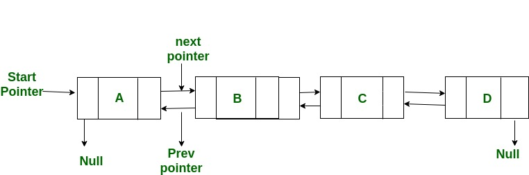

# problem

## describe

An XOR linked list is a more memory efficient doubly linked list. Instead of each node holding next and prev fields, it holds a field named both, which is an XOR of the next node and the previous node. Implement an XOR linked list; it has an add(element) which adds the element to the end, and a get(index) which returns the node at index.

If using a language that has no pointers (such as Python), you can assume you have access to get_pointer and dereference_pointer functions that converts between nodes and memory addresses.

## thought

感觉就是普通的构造一个双向链表,但是XOR具体指的什么我并不是很理解，搜了一下发现XOR链表是指异或链表，比一般双向链表的储存效率更高，根据异或逻辑的公式，`A XOR B XOR A = B`，因此在一个结点中，只需要储存`A XOR B` 的值，记为`npx` ,以及前一个结点的地址，就可以利用异或逻辑算出后一个地址。

